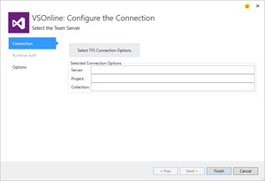
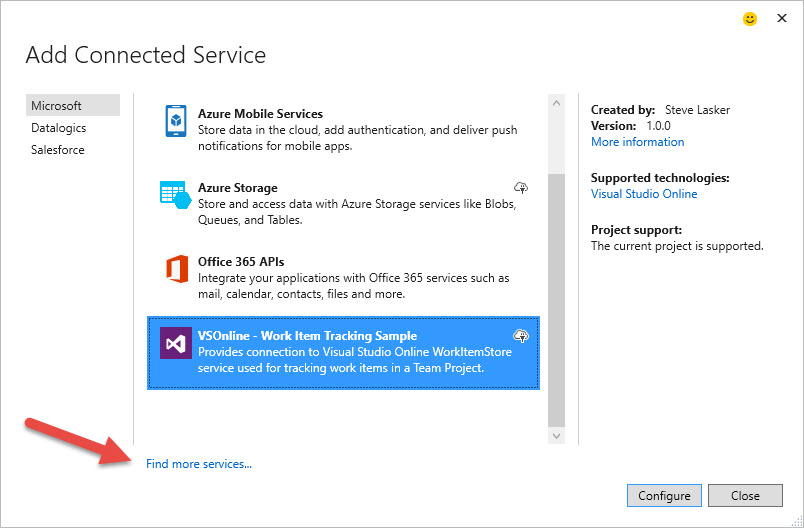
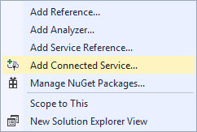

#Visual Studio Online Connected Service#
This VSOnline Connected Service is a sample for configuring your  **Visual Studio 2015** project to consume Team Foundation Server Online, or what's referred to as VSOnline

This Connected Service is currently just a sample to illustrate how to pull data from VSOnline and Salesforce as part of some //build and Ignite demos [Dave Carroll](https://twitter.com/dcarroll) and I'll be presenting/presented.

##State of the Connected Service##
###REST APIs###
Visual Studio Online has been improving their API access to include REST. This Connected Service includes an early sample to illustrate the REST usage. 

- The current version simply provides ReadOnly access to WorkItems
- Is limited to ServiceAccount Auth scenarios that require a UserName/Password in your project. 

##Code Contributions##
I do hope to improve upon this Connected Service. If you have an interest in spending more time, please feel free to create a fork and make a pull request. 

##Using the VSOnline Connected Service##
Using Visual Studio 2015, create any C# project, including Console, Winform, WPF or ASP.NET Web apps. To use this Connected Service:  
###Download the VSOnline Connected Service###
You can find this extension, or any other Connected Services Extension by: 

- Download from the [Visual Studio Gallery](https://visualstudiogallery.msdn.microsoft.com/0b7c4a20-cc91-41ac-ba75-170299a0a50e)
- Within Visual Studio, choose **Tools**-->**Extensions & Updates**, select **Online\Visual Studio Gallery\Tools\Connected Services**
- Within the Connected Services Selection window, choose **Find more services...**

###Add VSOnline to your project###
To setup the following demo in the [Getting Started][getting-started] walk through, lets create an ASP.NET MVC appliation
> **Note:** *I haven't reconciled the ASP.NET 5 references, so this is limited to ASP.NET 4.6*

Right-Click on the `References` folder and choose **Add Connected Service**

Choose the **VSOnline - Work Item Tracking Sample**

You can now choose the handy dandy TFS Selector to find your project

> **Note:** *While you can choose an On Prem TFS Server, I haven't done any testing for this scenario*

With your Server and Project selected, Choose the Auth Options

> Yes, I only have Service Account w/Username and Password enabled, but this is a demo. The main thing I wanted to show when authoring this Connected Service was the disablement of tabs and navigation buttons based on the current state of the [ConnectedServiceWizard](https://msdn.microsoft.com/en-us/library/microsoft.visualstudio.connectedservices.connectedservicewizard.aspx) Configurator.

Name your Service instance. This is the name of the folder that gets created under `Service References`, as well as the namespace used for this service class, and folder/namespace of the `WorkItem.cs` model.

Hit Finish, and follow the walk through in the [Getting Started][getting-started] doc.

[getting-started]:./GettingStarted/GettingStarted.md 
